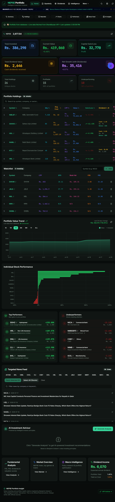
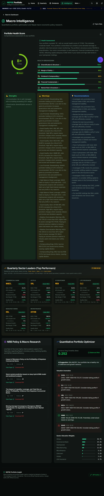
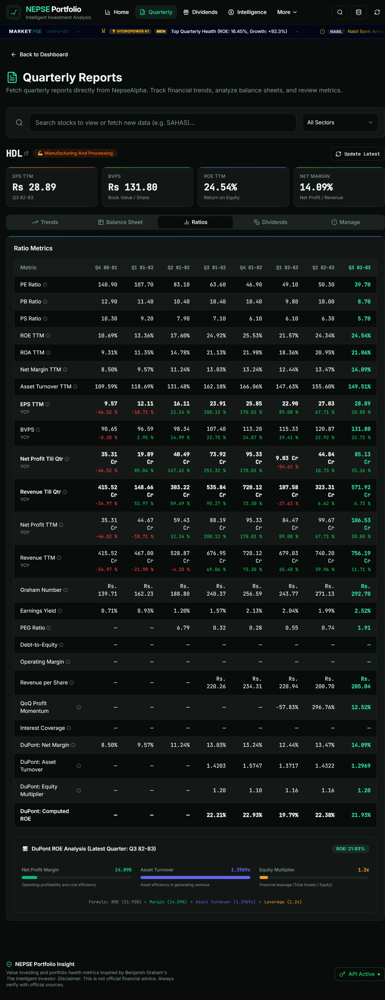
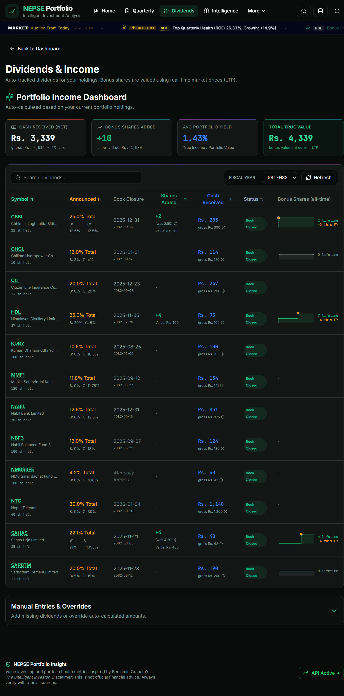

# 📈 NEPSE Portfolio Insight

**A local-first, privacy-respecting portfolio tracker and value-investing workbench for the Nepal Stock Exchange (NEPSE).**

Import your holdings once from Meroshare and everything else fills in automatically — live prices, gain/loss, dividends, quarterly fundamentals, a Benjamin-Graham-inspired health score, and AI-assisted analysis. No manual data entry, no cloud account, no data leaving your machine.

Built with **React + TypeScript + Tailwind + shadcn-ui** on the front end and lightweight **Python** services for the NEPSE data and local database.

---



---

## Why it exists

Most NEPSE investors juggle a broker portal, a spreadsheet, and a handful of news sites. Portfolio Insight pulls all of that into one clean dashboard you run on your own computer:

- **One-step import.** Drop your Meroshare CSV and your entire portfolio loads instantly — no typing in symbols, quantities, or cost prices.
- **Automatic, not button-heavy.** Prices and portfolio value refresh on their own; news and dividends refresh once a day in the background.
- **Local-first & private.** Your holdings live in a JSON file on your machine (`db/portfolio.json`, git-ignored) — nothing is uploaded anywhere.
- **Value-investing lens.** Health scoring, margin-of-safety checks, Graham numbers, and valuation anomalies inspired by *The Intelligent Investor*.

---

## What's inside

### 🏠 Dashboard — your portfolio at a glance
Total invested, current value, capital gain/loss, dividend income, and net growth (including dividends) as headline KPIs — followed by a live, sortable holdings table with per-stock gain/loss and dividend breakdown, a watchlist, a portfolio value trend chart, individual stock performance, and top-performers vs. underperformers. A targeted news feed and an AI Investment Advisor round out the page.

*(shown above)*

### 🧠 Macro Intelligence — how healthy is your portfolio?
A single **Portfolio Health Score** graded across diversification, margin of safety, dividend compounding, financial fundamentals, and market risk — with concrete strengths, warnings, and recommendations. Includes quarterly sector leaders, a quantitative optimizer (volatility drag, valuation anomalies, sector allocation), and a live feed of Nepal macro-economic / NRB policy research.



### 📊 Quarterly Fundamentals — deep company analysis
Quarter-by-quarter financials pulled straight from source: EPS, BVPS, ROE, ROA, net margin, PE/PB/PS ratios, Graham number, earnings yield, and a full **DuPont ROE decomposition** — all with year-over-year deltas colour-coded green/red so trends jump out.



### 💰 Dividends & Income — every rupee accounted for
Auto-tracked cash and bonus dividends for each holding, with bonus shares valued at real-time market price (LTP). See net cash received, bonus shares added, average portfolio yield, book-closure dates, and per-stock dividend history — plus manual overrides for anything the auto-tracker misses.



---

## Getting your portfolio from Meroshare

1. Log in to **Meroshare**.
2. Open **My Purchase Source** (Portfolio).
3. Click **CSV** to download — on mobile, tap the **⋮** menu, then **CSV**.
4. Drag that file into the app's import box (shown automatically on first run).

That's it — every chart, score, and insight populates from that one file.

---

## Running the app (Windows)

The app runs three local services: a portfolio database (port 5001), a NEPSE data
server (port 8000), and the web UI (port 5173). One launcher starts all of them.

### First-time setup

Run these once:

```sh
# 1. Frontend dependencies
npm install

# 2. Python backend dependencies (creates a virtual environment)
python -m venv .venv
.venv\Scripts\pip install -r requirements.txt

# 3. Seed an empty portfolio (real holdings load later via CSV import)
copy db\portfolio.example.json db\portfolio.json
```

### Every day after that

Just **double-click `PortfolioInsight.vbs`** (or `start.bat`). It starts all three
services and opens the app in your browser automatically.

You can also start it from a terminal:

```sh
npm start      # start all services
npm run stop   # stop the background services
```

The application opens at `http://localhost:5173`.

---

## Privacy

Your real holdings never leave your computer. `db/portfolio.json` is **git-ignored**, so
your portfolio is never committed or pushed. The repository ships only
`db/portfolio.example.json` (an empty template).

---

## Tech stack

- **Frontend:** Vite, TypeScript, React, shadcn-ui, Tailwind CSS
- **Backend:** Python — a stdlib HTTP server for the local portfolio database and a
  Flask/stdlib service for live NEPSE market data
- **Data sources:** NEPSE (live prices/indices), ShareSansar (company news, direct HTTP — no paid APIs), NepseAlpha (quarterly fundamentals)

---

> **Disclaimer:** Value-investing and portfolio-health metrics are inspired by Benjamin Graham's *The Intelligent Investor*. This is **not** official financial advice — always verify against official sources before making investment decisions.
